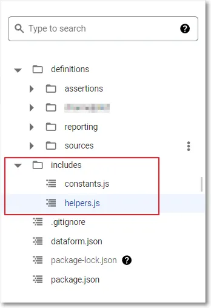
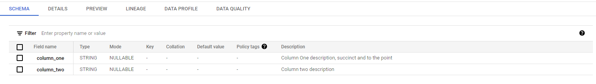

# Centralising & Automating Dataform Column Descriptions

This is a quick guide which shows you how to centralise your column descriptions so they can be updated/edited in one place. The advantage of this is that you can avoid duplication in column descriptions and ensure the column descriptions across your dataset are identical and do not diverge. Nobody wants to go into a repo and have to edit every tables schema when a change is made.

# How it works

The backbone of dataform is javascript, the benefit of this is that they allow you to use javascript code within dataform. Here is a good article showcasing some of the features with javascript within dataform: https://blog.datatovalue.nl/dataform-javascript-utility-functions-for-ga4-tables-257dd54b034e

The code to generate the schema descriptions is shown below:

```js
const schemaDescriptions = {   
    /*
     * Column descriptions
     */
column_one: "Column One description, succinct and to the point",
column_two: "Column two description" 
}

const getSchemaDescriptions = (customDescriptions) => {
  return Object.assign({}, schemaDescriptions, customDescriptions);
}

module.exports = { getSchemaDescriptions };
```

Put this code in a constants.js file located in the includes folder in Dataform. This folder allows you to reuse code across your repository.



## Applying the schema code

Once you have this javascript code you can implement it in all your SQLX scripts. Apply the function to columns in the config to ensure the descriptions are added to the table.

``` sql
config {
  type: "table",
  columns: constants.getSchemaDescriptions()
}

SELECT
  column_one
  column_two
FROM ${ref("table")}
```

When you have run your dataform pipeline your table will be created with the column descriptions added as shown below.



Its as simple as that! No more excuses for missing column descriptions.
